# Infin8 DevOps Deployment Guide

This project implements a complete DevOps framework to automate the Software Development Life Cycle (SDLC) using a comprehensive suite of tools for Version Control, CI/CD, Containerization, Orchestration, Configuration Management, and Monitoring.

---

## 📋 Table of Contents
1. [System Architecture](#-system-architecture)
2. [DevOps Tools](#-devops-tools-overview)
3. [CI/CD Pipeline Flow](#-cicd-pipeline-flow)
4. [Version Control](#-1-version-control-git--github)
5. [CI/CD Automation](#-2-cicd-automation-jenkins)
6. [Containerization](#-3-containerization-docker)
7. [Configuration Management](#-4-configuration-management-ansible)
8. [Orchestration & Scaling](#-5-orchestration--scaling-kubernetes)
9. [Monitoring & Logging](#-6-monitoring--logging-elk-stack)
10. [Security & Secrets Management](#-7-security--secrets-management)
11. [Advanced Features](#-8-advanced-features)
12. [Validation Guide](#-validation-guide)

---

## 🏗️ System Architecture

The Infin8 project follows a modern DevOps architecture with automated CI/CD pipelines, containerized deployments, and comprehensive monitoring.


### **Architecture Flow**
1. **Developer** pushes code to **GitHub**.
2. **Jenkins** is triggered via webhook/polling.
3. **Docker image** is built and tested.
4. Image is pushed to **Docker Hub**.
5. **Ansible** deploys to **Kubernetes**.
6. **K8s** manages deployments with **HPA** for auto-scaling.
7. **NGINX Ingress** routes traffic (80% stable, 20% canary).
8. **Application logs** → **Logstash** → **Elasticsearch** → **Kibana**.
9. **Vault** securely provides credentials to all services.

---

## 🚀 DevOps Tools Overview

| Category | Tool | Purpose |
|----------|------|---------|
| **Version Control** | Git & GitHub | Source code management and collaboration |
| **CI/CD Automation** | Jenkins | Automated pipelines for building, testing, and deploying |
| **Build & Test** | Docker | Containerization and isolated test environments |
| **Registry** | Docker Hub | Central repository for Docker images |
| **Configuration Mgmt** | Ansible | Infrastructure as Code with modular roles |
| **Orchestration** | Kubernetes (Minikube) | Container orchestration, scaling, and networking |
| **Load Balancing** | NGINX Ingress | Traffic routing and canary deployments |
| **Monitoring** | Metricbeat | System and container metrics collection |
| **Logging** | Logstash | Log processing and transformation |
| **Storage** | Elasticsearch | Log and metrics storage |
| **Visualization** | Kibana | Dashboard for logs and metrics |
| **Security** | HashiCorp Vault | Secrets management |
| **Secrets** | Kubernetes Secrets | Runtime environment variable injection |

---

## 🔄 CI/CD Pipeline Flow

### **Automated Deployment Pipeline**

```mermaid
sequenceDiagram
    participant Dev as Developer
    participant Git as GitHub
    participant Jenkins as Jenkins
    participant Docker as Docker Build
    participant Tests as Test Suite
    participant Hub as Docker Hub
    participant Ansible as Ansible
    participant K8s as Kubernetes
    participant User as End User
    
    Dev->>Git: git push
    Git->>Jenkins: Webhook Trigger
    Jenkins->>Git: Checkout Code
    Jenkins->>Docker: Build Image
    Docker->>Jenkins: Image Built
    Jenkins->>Tests: Run Tests
    Tests->>Jenkins: ✓ Tests Pass
    Jenkins->>Hub: Push Image (latest)
    Hub->>Jenkins: ✓ Push Complete
    Jenkins->>Ansible: Execute Playbook
    Ansible->>K8s: Apply Manifests
    K8s->>K8s: Rolling Update
    K8s->>User: ✓ New Version Live
```



### **Pipeline Stages (Jenkinsfile)**

#### **Stage 1: Checkout**
- Jenkins fetches the latest code from GitHub
- Triggered by: Git webhook or SCM polling

#### **Stage 2: Build Docker Image**
```bash
docker build -t dhruvk321/infin8:latest .
```
- Creates containerized application image
- Includes Python dependencies and application code

#### **Stage 3: Automated Testing**
```bash
docker run --rm \
  -e USE_SQLITE=True \
  dhruvk321/infin8:latest \
  python manage.py test
```
- Runs unit tests in isolated container
- Uses SQLite to avoid MySQL dependency
- Pipeline fails if tests fail

#### **Stage 4: Push to Docker Hub**
```bash
echo $DOCKER_PASS | docker login -u $DOCKER_USER --password-stdin
docker push dhruvk321/infin8:latest
```
- Stores image in central registry
- Uses Jenkins credentials for authentication

#### **Stage 5: Deploy via Ansible**
```bash
ansible-playbook ansible/k8s-playbook.yaml
```
- Applies Kubernetes manifests
- Triggers rolling update
- Zero downtime deployment

---

## 📦 1. Version Control (Git & GitHub)

### **Repository Structure**
```
Infin8-2024/
├── Infin8/                    # Django application code
├── k8s/                       # Kubernetes manifests
│   ├── deployment.yaml        # Main app deployment
│   ├── canary.yaml           # Canary deployment
│   ├── hpa.yaml              # Horizontal Pod Autoscaler
│   ├── ingress.yaml          # Traffic routing
│   └── elk-stack.yaml        # Monitoring stack
├── ansible/                   # Configuration management
│   ├── k8s-playbook.yaml     # Main playbook
│   └── roles/                # Modular roles
├── Jenkinsfile               # CI/CD pipeline definition
├── Dockerfile                # Container build instructions
└── docker-compose.yml        # Local development setup
```

### **Git Workflow**
1. Developer makes changes locally
2. Commits with descriptive message
3. Pushes to GitHub repository
4. **Automatic trigger** initiates CI/CD pipeline

---

## 🔧 2. CI/CD Automation (Jenkins)

### **GitHub Hook Configuration**
- **Trigger Type**: GitHub Hook Trigger for GITScm polling
- **Webhook URL**: `http://<jenkins-server>/github-webhook/`
- **Events**: Push events

### **Pipeline Features**
- ✅ **Automated Build**: Triggered on every Git push
- ✅ **Automated Testing**: Unit tests run before deployment
- ✅ **Quality Gate**: Deployment only if tests pass
- ✅ **Docker Integration**: Build and push images
- ✅ **Deployment Automation**: Ansible-driven K8s updates

### **Pipeline Visualization**
```
[Git Push] → [Jenkins Trigger] → [Build] → [Test] → [Push] → [Deploy]
                                    ↓         ↓        ↓        ↓
                                  Docker   Python   Hub    Ansible
```

---

## 🐳 3. Containerization (Docker)

### **Dockerfile**
- **Base Image**: Python 3.x
- **Application**: Django web framework
- **Dependencies**: Installed via `requirements.txt`
- **Startup Command**: `python manage.py runserver`

### **Docker Compose (Local Development)**
Services defined:
- **mysql**: Database service
- **elasticsearch**: Log storage
- **logstash**: Log processing
- **kibana**: Dashboard
- **metricbeat**: Metrics collection
- **vault**: Secrets management

### **Benefits**
- ✅ **Consistency**: Same environment across dev/staging/prod
- ✅ **Isolation**: Dependencies don't conflict
- ✅ **Portability**: Runs anywhere Docker is installed
- ✅ **Fast Deployment**: Pre-built images = quick startup

---

## ⚙️ 4. Configuration Management (Ansible)

### **Modular Design with Roles**
Located in `ansible/roles/`, each role handles specific tasks:

#### **k8s_deploy Role**
```yaml
ansible/
└── roles/
    └── k8s_deploy/
        ├── tasks/
        │   └── main.yaml       # Deployment tasks
        └── files/
            └── *.yaml          # K8s manifests
```

**Tasks**:
1. Apply deployment manifests
2. Apply service configurations
3. Configure Ingress rules
4. Set up HPA
5. Deploy ELK stack

### **Playbook Execution**
```bash
ansible-playbook ansible/k8s-playbook.yaml
```

### **Benefits of Ansible**
- ✅ **Idempotent**: Safe to run multiple times
- ✅ **Modular**: Reusable roles
- ✅ **Declarative**: Describe desired state
- ✅ **Agentless**: No software on target servers

---

## ☸️ 5. Orchestration & Scaling (Kubernetes)

### **Deployment Strategy**
- **Type**: Rolling Update
- **Max Surge**: 1 pod
- **Max Unavailable**: 0 pods
- **Result**: Zero downtime during updates

### **Core Resources**

#### **Deployments**
1. **mysql**: Database with persistent storage
2. **infin8-app**: Main application (Stable)
3. **infin8-canary**: Canary version for testing

#### **Services**
- **mysql**: ClusterIP on port 3306
- **infin8-stable**: Routes to stable pods
- **infin8-canary**: Routes to canary pods

#### **Ingress**
- **NGINX Ingress Controller**
- **Traffic Split**: 80% stable, 20% canary
- **Annotation**: `nginx.ingress.kubernetes.io/canary-weight: "20"`

### **Horizontal Pod Autoscaler (HPA)**
```yaml
Target: infin8-app
Min Replicas: 1
Max Replicas: 5
CPU Threshold: 20%
```

**Behavior**:
- Monitors CPU usage every 15 seconds
- Scales up immediately when CPU > 20%
- Scales down gradually after 60 seconds

### **Canary Deployment**
1. Deploy new version to canary pods
2. NGINX routes 20% of traffic to canary
3. Monitor logs/metrics in Kibana
4. If healthy: Promote to stable (update main deployment)
5. If unhealthy: Rollback (delete canary deployment)

---

## 📊 6. Monitoring & Logging (ELK Stack)

### **Complete Logging Flow**


### **Components**

#### **Elasticsearch**
- **Purpose**: Stores logs and metrics
- **Deployment**: StatefulSet with persistent volume
- **Indices**: 
  - `infin8-YYYY.MM.DD` (Application logs)
  - `metricbeat-k8s-YYYY.MM.DD` (K8s metrics)
  - `metricbeat-system-YYYY.MM.DD` (System metrics)

#### **Logstash**
- **Purpose**: Log processing pipeline
- **Inputs**:
  - TCP port 5000 (Django app logs)
  - Beats port 5044 (Metricbeat)
- **Filters**:
  - Add environment tags
  - Parse log levels
  - Convert data types
  - Tag error logs
- **Output**: Elasticsearch

**Configuration** (`logstash.conf`):
```ruby
input {
  tcp {
    port => 5000
    codec => json_lines
    type => "django"
  }
}

filter {
  mutate {
    add_field => {
      "environment" => "production"
      "application" => "infin8"
    }
  }
}

output {
  elasticsearch {
    hosts => ["elasticsearch:9200"]
    index => "infin8-%{+YYYY.MM.dd}"
  }
}
```

#### **Kibana**
- **Purpose**: Visualization and dashboards
- **Access**: `http://localhost/kibana` (via Ingress)
- **Features**:
  - Real-time log streaming
  - Custom dashboards
  - Index pattern management
  - Query interface

#### **Metricbeat**
- **Purpose**: Metrics collection
- **Deployment**: DaemonSet (one per node)
- **Metrics Collected**:
  - CPU usage
  - Memory usage
  - Network I/O
  - Disk I/O
  - Pod statistics
  - Container statistics

### **Application Logging Integration**
Django is configured to send logs to Logstash:

**settings.py**:
```python
LOGGING = {
    'handlers': {
        'logstash': {
            'class': 'logstash.TCPLogstashHandler',
            'host': 'logstash',
            'port': 5000,
            'version': 1,
            'message_type': 'django',
        },
    },
    'root': {
        'handlers': ['console', 'logstash'],
        'level': 'INFO',
    },
}
```

### **Kibana Setup**
1. Navigate to `http://localhost/kibana`
2. Go to **Stack Management** → **Index Patterns**
3. Create pattern: `infin8-*` (for app logs)
4. Create pattern: `metricbeat-*` (for metrics)
5. Go to **Discover** to view logs
6. Build custom dashboards in **Dashboard** section

---

## 🔐 7. Security & Secrets Management

### **HashiCorp Vault Integration**

**Purpose**: Centralized secrets storage

**Secrets Stored**:
- Database credentials
- Email service passwords
- API keys
- Django secret key

**Application Integration**:
```python
# settings.py
import hvac

client = hvac.Client(url=VAULT_ADDR, token=VAULT_TOKEN)
vault_data = client.secrets.kv.v2.read_secret_version(path='infin8')
db_password = vault_data['data']['data']['MYSQL_PASSWORD']
```

### **Kubernetes Secrets**
Created via:
```bash
kubectl create secret generic infin8-secrets \
  --from-literal=mysql-password=<password> \
  --from-literal=admin-password=<password> \
  --from-literal=email-password=<password>
```

**Injection into Pods**:
```yaml
env:
  - name: MYSQL_PASSWORD
    valueFrom:
      secretKeyRef:
        name: infin8-secrets
        key: mysql-password
```

### **Security Best Practices**
- ✅ No hardcoded credentials
- ✅ Secrets encrypted at rest
- ✅ Secrets not committed to Git
- ✅ Environment-specific configurations
- ✅ Role-based access control (RBAC) in K8s

---

## 🎯 8. Advanced Features

### **Live Patching (Zero Downtime Updates)**
**Mechanism**: Rolling Update Strategy

**Process**:
1. New version pushed to Docker Hub
2. Ansible applies updated deployment
3. K8s starts new pod with new image
4. **Readiness probe** checks if pod is ready
5. Once ready, K8s routes traffic to new pod
6. Old pod continues serving existing requests
7. After grace period, old pod is terminated

**Configuration**:
```yaml
strategy:
  type: RollingUpdate
  rollingUpdate:
    maxSurge: 1
    maxUnavailable: 0
```

**Validation**:
- Run `verify_patching.sh` during deployment
- No HTTP errors during update
- Continuous 200 OK responses

### **High Availability & Scalability**

#### **Horizontal Pod Autoscaler (HPA)**
- **Trigger**: CPU > 20%
- **Scale Range**: 1-5 pods
- **Scale Up**: Immediate (0s stabilization)
- **Scale Down**: Gradual (60s stabilization)

**Testing**:
```bash
./load_test.sh http://localhost
kubectl get hpa -w  # Watch scaling in real-time
```

#### **Canary Deployments**
- **Purpose**: Test new features with subset of users
- **Traffic Split**: Configurable (default 20%)
- **Rollback**: Delete canary deployment if issues detected
- **Promotion**: Update stable deployment with canary image

### **Modular Ansible Roles**
- **k8s_deploy**: Handles all K8s deployments
- **Reusable**: Can be used across multiple projects
- **Maintainable**: Each role has specific responsibility
- **Testable**: Roles can be tested independently

---

## ✅ Validation Guide

### **1. Verify CI/CD Pipeline**
```bash
# Make a change and push
git commit --allow-empty -m "Test pipeline"
git push

# Watch Jenkins dashboard
# Pipeline should: Checkout → Build → Test → Push → Deploy
```

### **2. Verify Application Deployment**
```bash
# Check pod status
kubectl get pods
# Expected: infin8-app, mysql, elasticsearch, logstash, kibana, metricbeat

# Access application
http://localhost/
```

### **3. Verify Canary Deployment**
```bash
# Refresh browser 10-15 times
# ~20% of requests should show yellow banner:
# "⚠️ CANARY VERSION (v1.1) ⚠️"
```

### **4. Verify Auto-Scaling**
```bash
# Run load test
./load_test.sh http://localhost

# Watch HPA
kubectl get hpa -w
# REPLICAS should increase from 1 to 5
```

### **5. Verify Live Patching**
```bash
# Start monitoring
./verify_patching.sh http://localhost

# In another terminal, trigger deployment
git commit -m "Update" && git push

# Monitor should show continuous "SUCCESS (200 OK)"
# No downtime during update
```

### **6. Verify ELK Stack**
```bash
# Generate traffic
curl http://localhost/ -H "User-Agent: LoadTest"

# Open Kibana
http://localhost/kibana

# Create index pattern: infin8-*
# Go to Discover
# Filter by: application: "infin8"
# Expected: See application logs with request details
```

### **7. Verify Secrets Management**
```bash
# Check Vault status
kubectl exec -it vault-pod -- vault status

# Verify secrets are not in Git
git grep -i password
# Should return no results (except comments)
```

---

## 🎓 Project Requirements Compliance

| Requirement | Implementation | Status |
|-------------|----------------|--------|
| Version Control | Git & GitHub | ✅ |
| CI/CD Automation | Jenkins with webhook triggers | ✅ |
| Automated Build | Docker image build in pipeline | ✅ |
| Automated Tests | Unit tests in pipeline | ✅ |
| Docker Registry | Push to Docker Hub | ✅ |
| Automated Deployment | Ansible playbook execution | ✅ |
| Seamless Updates | Rolling updates with zero downtime | ✅ |
| Application Logs | Django → Logstash → ES → Kibana | ✅ |
| Metrics Collection | Metricbeat → Logstash → ES → Kibana | ✅ |
| Secure Storage | Vault integration | ✅ |
| Modular Design | Ansible roles | ✅ |
| High Availability | HPA for auto-scaling | ✅ |
| Live Patching | RollingUpdate strategy | ✅ |
| Canary Deployments | 20% traffic split via Ingress | ✅ |

---

## 📚 Additional Resources

- [Jenkinsfile](Jenkinsfile) - Complete pipeline definition
- [RUN_DEMO.md](RUN_DEMO.md) - Step-by-step execution guide
- [SETUP.md](SETUP.md) - Initial setup instructions
- [ELK_SETUP.md](ELK_SETUP.md) - Monitoring stack configuration
- [AUTO_CANARY_README.md](AUTO_CANARY_README.md) - Canary automation details

---

## 🤝 Support

For issues or questions:
1. Check logs: `kubectl logs <pod-name>`
2. Review Kibana dashboards
3. Verify pipeline stages in Jenkins
4. Consult project documentation
