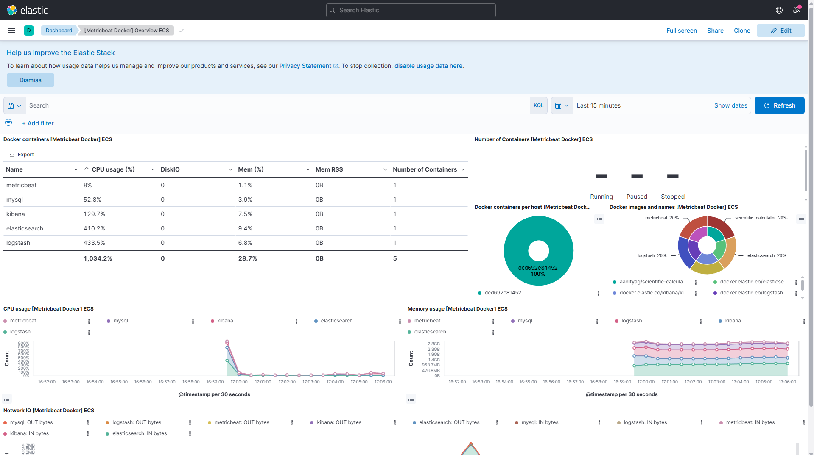

(Copy and paste this into your project documentation)
Resource Monitoring (ELK Stack) Setup
We use the ELK stack (Elasticsearch, Logstash, Kibana) + Metricbeat to monitor the resource usage of our project locally.

1. Prerequisites
WSL Users: Ensure you have docker-compose installed.

RAM: This stack is heavy. Ensure Docker Desktop has at least 4GB of RAM allocated.

2. Configuration
All monitoring configurations are located in the monitoring/ directory. Do not modify these files unless you know what you are doing.

3. How to Start
Run the project and build the monitoring tools:

docker-compose up -d --build
Wait about 60 seconds for the containers to initialize.

4. First-Time Setup (Crucial)
If this is your first time running the stack, you must load the visual dashboards manually. Run this command while the containers are running:

docker-compose exec metricbeat metricbeat setup --dashboards

Wait for the success message: "Loaded dashboards".

5. Viewing the Graphs
Go to http://localhost:5601.

Navigate to Menu (☰) -> Dashboard.

Search for "Docker" and click "[Metricbeat Docker] Overview".

